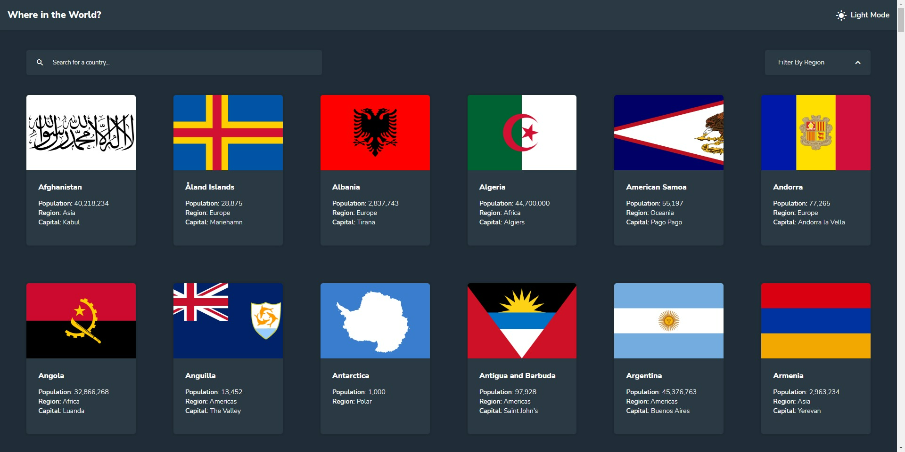

# Frontend Mentor - REST Countries API with color theme switcher solution

This is a solution to the [REST Countries API with color theme switcher challenge on Frontend Mentor](https://www.frontendmentor.io/challenges/rest-countries-api-with-color-theme-switcher-5cacc469fec04111f7b848ca). Frontend Mentor challenges help you improve your coding skills by building realistic projects.

## Table of contents

- [Overview](#overview)
  - [The challenge](#the-challenge)
  - [Screenshot](#screenshot)
  - [Links](#links)
- [My process](#my-process)
  - [Built with](#built-with)
  - [What I learned](#what-i-learned)
  - [Continued development](#continued-development)
  - [Useful resources](#useful-resources)
- [Author](#author)
- [Acknowledgments](#acknowledgments)

## Overview

### The challenge

Users should be able to:

- See all countries from the API on the homepage
- Search for a country using an `input` field
- Filter countries by region
- Click on a country to see more detailed information on a separate page
- Click through to the border countries on the detail page
- Toggle the color scheme between light and dark mode _(optional)_

### Screenshot

### Links

- Solution URL: [Add solution URL here](https://your-solution-url.com)
- Live Site URL: [App](https://webguy83.github.io/rest-api-countries/)

## My process

### Built with

- [Angular](https://angular.io/) - JS library
- [Angular Material](https://material.angular.io/) - Angular Library
- CSS custom properties
- Flexbox
- CSS Grid

### What I learned

Constructing a workflow in Angular and customizing the UI/colour layouts in Angular Material for the first time. Managed to keep media queries to a bare minimum and have it responsive.

### Continued development

Mostly work on optimal ways of working with Angular services and customizing things in Angular Material.

### Useful resources

- [Angular](https://angular.io/) - The single source of truth.
- [Angular University](https://blog.angular-university.io/) - One of the best courses to learn Angular with.

## Author

- Github - [Curtis](https://github.com/webguy83)
- Frontend Mentor - [@webguy83](https://www.frontendmentor.io/webguy83)
